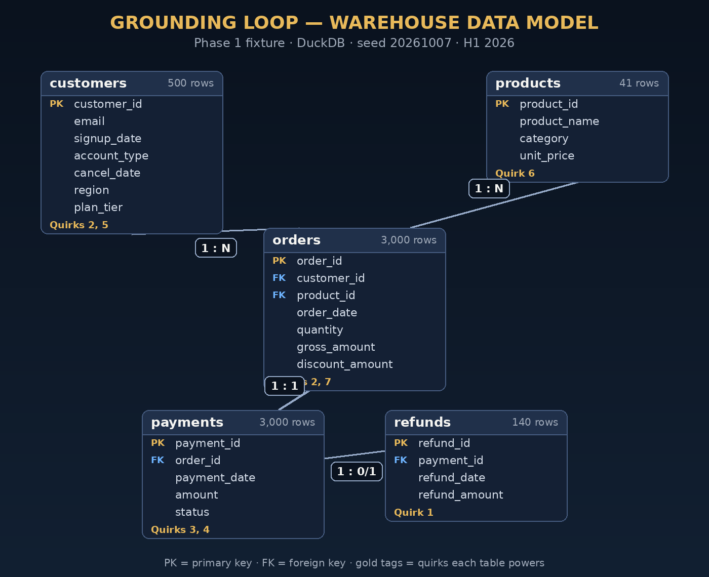

# Phase 1 — Data model

The Grounding Loop's warehouse is a finance-flavored e-commerce fixture:
a SaaS-ish company selling products over H1 2026 (2026-01-01 → 2026-06-30,
so Q1-vs-Q2 comparisons work). Built by `build_warehouse.py` with a seeded
RNG (`20261007`) — the fixture rebuilds identically every run.



## Tables

### customers — 500 rows, one per account
| column | type | notes |
|---|---|---|
| customer_id | INTEGER PK | |
| email | VARCHAR | synthetic `userNNNN@example.com` |
| signup_date | DATE | uniform across H1 |
| account_type | VARCHAR | `trial` 12% / `paid` 80% / `cancelled` 8% |
| cancel_date | DATE | NULL unless cancelled (cancel dates from Feb 1 on) |
| region | VARCHAR | west / east / central / intl |
| plan_tier | VARCHAR | starter / growth / enterprise |

### products — 41 rows
| column | type | notes |
|---|---|---|
| product_id | INTEGER PK | |
| product_name | VARCHAR | `product_01` … `product_40`, plus `free_addon` |
| category | VARCHAR | analytics / storage / compute / support |
| unit_price | DECIMAL(10,2) | $19–$4,999 uniform; product 41 = **$0.00** (Quirk 6) |

### orders — 3,000 rows, one per order
| column | type | notes |
|---|---|---|
| order_id | INTEGER PK | |
| customer_id | INTEGER FK → customers | any account type — **trials can order** (Quirk 2) |
| product_id | INTEGER FK → products | |
| order_date | DATE | uniform across H1 |
| quantity | INTEGER | 1–5 |
| gross_amount | DECIMAL(10,2) | unit_price × quantity |
| discount_amount | DECIMAL(10,2) | 0%, 10%, 15% or 20% of gross (Quirk 7: discounts are order-level) |

### payments — 3,000 rows, exactly one payment attempt per order
| column | type | notes |
|---|---|---|
| payment_id | INTEGER PK | |
| order_id | INTEGER FK → orders | 1:1 with orders |
| payment_date | DATE | 0–3 days after order; ~5% land 31–75 days later (Quirk 3: late partitions) |
| amount | DECIMAL(10,2) | gross_amount − discount_amount |
| status | VARCHAR | settled 80% / pending_settlement 6% / failed 5% / refunded 5% / chargeback 2% / voided 2% (Quirk 4: only `settled` is revenue) |

### refunds — 140 rows, one per refund event
| column | type | notes |
|---|---|---|
| refund_id | INTEGER PK | |
| payment_id | INTEGER FK → payments | only `refunded` payments get a row |
| refund_date | DATE | 1–45 days **after** the payment date (Quirk 1) |
| refund_amount | DECIMAL(10,2) | full payment, or 30% partial at 20–80% of it (Quirk 1) |

## Relationships

```
customers 1 ──< orders >── 1 products
orders    1 ──|| payments
payments  1 ──o| refunds
```

- customers 1:N orders; products 1:N orders
- orders 1:1 payments (failure is a *status*, not a separate row — no retry rows)
- payments 1:0/1 refunds

## Deliberate simplifications (not quirks)

- Orders are single-product lines — no multi-line orders.
- Exactly one payment per order — no split payments.
- Payment amount always equals net order value (gross − discount).
- Trial accounts can place orders (product-led motion). This is *quirk-adjacent*:
  it's the reason naive "active customer" counts are wrong.

## How the quirks map to the model

| quirk | where it lives | trap it powers |
|---|---|---|
| 1 — refunds dated later, partial | refunds.refund_date, refund_amount | monthly netting; full-vs-partial refund sums |
| 2 — trials order | orders.customer_id → trial customers | COUNT(DISTINCT customer_id) overcounts "active" |
| 3 — late partitions | payments.payment_date (+31–75d) | "is June revenue final?" |
| 4 — statuses that look like revenue | payments.status | SUM(amount) overstates revenue ~20% |
| 5 — cancelled customers | customers.account_type, cancel_date | churn denominator games |
| 6 — $0 product | products.unit_price = 0 (id 41) | AOV denominator: per order vs per unit |
| 7 — order-level discounts | orders.discount_amount | gross vs net discipline |

## Downstream use

- **Phase 2** semantic models map 1:1 onto these tables (payments, refunds,
  orders, customers). `products` has no model yet — which is why "units sold"
  is unanswerable through the v1 layer.
- **Phase 3** trap questions: every quirk above powers at least one trap.
- **Phase 5 (planned):** Quirk 3 becomes the data-drift/freshness exercise.
